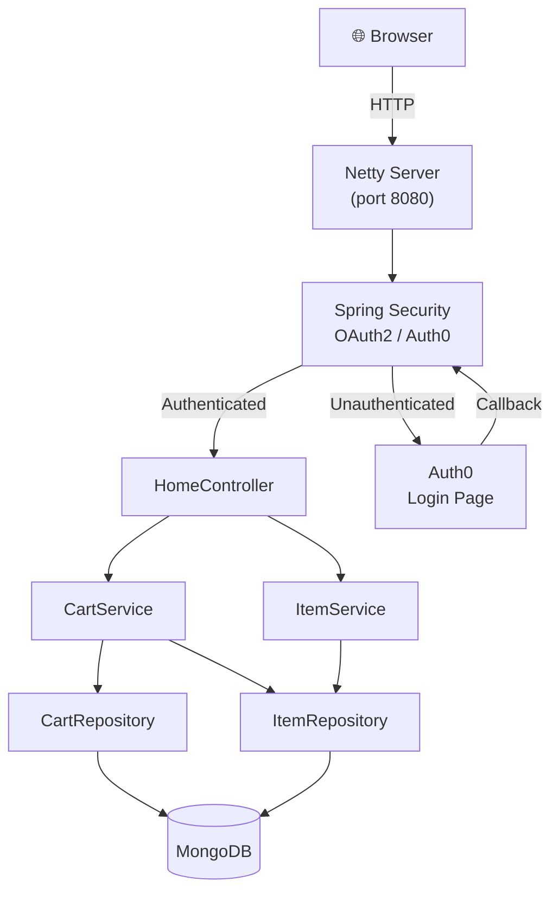

# 🛒 microSpring

A reactive shopping cart web application built with Spring Boot WebFlux, MongoDB, and Auth0 OAuth2 authentication.

---

## 🏗️ Architecture



---

## ⚙️ Tech Stack

| Layer | Technology |
|---|---|
| Language | Java 21 |
| Framework | Spring Boot 4 (WebFlux — reactive/non-blocking) |
| Database | MongoDB (Reactive) |
| Auth | Auth0 via OAuth2 / OIDC |
| Templating | Thymeleaf |
| Build | Gradle |
| Reactive | Project Reactor (Mono / Flux) |

---

## 🚀 Running Locally

### Prerequisites
- Java 21+
- Docker (for MongoDB)
- An Auth0 account

### 1. Start MongoDB
```bash
docker run -d -p 27017:27017 --name microspring-mongo mongo
```

### 2. Configure Auth0
In `src/main/resources/application.properties`, set your Auth0 credentials:
```properties
spring.security.oauth2.client.registration.auth0.client-id=YOUR_CLIENT_ID
spring.security.oauth2.client.registration.auth0.client-secret=YOUR_CLIENT_SECRET
spring.security.oauth2.client.provider.auth0.issuer-uri=https://YOUR_DOMAIN.auth0.com/
```

In your Auth0 Dashboard → Application → Settings:
- **Allowed Callback URLs**: `http://localhost:8080/login/oauth2/code/auth0`
- **Allowed Logout URLs**: `http://localhost:8080`
- **Allowed Web Origins**: `http://localhost:8080`

### 3. Run
```bash
./gradlew bootRun
```

Open **http://localhost:8080**

---

## 📡 API Endpoints

| Method | Path | Auth | Description |
|--------|------|------|-------------|
| GET | `/` | ❌ | Home — shows inventory and cart (if logged in) |
| POST | `/add/{itemId}` | ✅ | Add item to user's cart |
| DELETE | `/remove/{itemId}` | ✅ | Remove one item from user's cart |
| POST | `/item` | ❌ | Create a new inventory item |
| DELETE | `/item/{id}` | ❌ | Delete an inventory item |

---

## 📦 Project Structure

```
src/main/java/com/bawantha/microSpring/
├── config/
│   └── SecurityConfig.java       # OAuth2 / WebFlux security chain
├── controller/
│   └── HomeController.java       # HTTP routes
├── entity/
│   ├── Item.java                 # Inventory item
│   ├── Cart.java                 # Shopping cart
│   ├── CartItem.java             # Cart line item (item + quantity)
│   └── User.java                 # User entity
├── repository/
│   ├── ItemRepository.java       # Reactive MongoDB repo
│   ├── CartRepository.java
│   └── UserRepository.java
└── service/
    ├── CartService.java          # Cart & inventory logic
    └── ItemService.java          # Item CRUD
```
